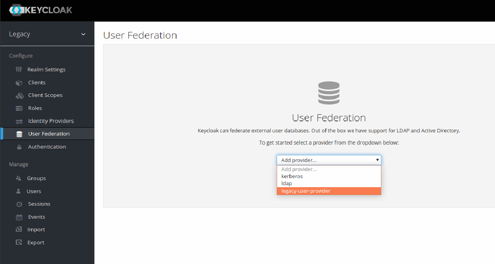

# Keycloak SPI example
An example of implementing a Service Provider Interface (SPI) for Keycloak.

Compatible and tested with Keycloak 22.0.1

When legacy systems are involved, it is a common requirement to integrate users from those systems. To facilitate this integration, Keycloak supports something called _custom providers_. This particular example illustrates how to build a SPI that integrates a legacy database into Keycloak.

This provider creates a new Keycloak user when a unknown user is logged with the external provider. Thus, it will only use the new Keycloak user.

## Building the Module

This is a Java Maven project, so just execute ```mvn clean package```. 
This builds a ```jar``` in the target directory. 

### 

In the ```pom.xml``` file there are some important things to consider:

* Put a ```<scope>provided</scope>``` for each ```<groupId>org.keycloak</groupId>``` otherwise there can be conflicts with your Keycloak instance libraries. It impacts the size of the JAR file with dependencies
* This module needs the PostgreSQL and Bcrypt dependencies, thus you have to put the JAR with the dependencies in it.
* You have to specify the ```<keycloak.version>22.0.1</keycloak.version>```

## Installing the module

### Manual

Copy the jar file to  ```/opt/keycloak/providers```:

~~~
    ~/standalone/deployments ll
    total 22140
    drwxr-xr-x 2 user user     4096 abr 27 12:56 ./
    drwxr-x--x 8 user user     4096 abr 23 20:33 ../
    -rw-rw-r-- 1 user user 11318774 abr 26 16:27 demo-0.0.1.jar
~~~


## Using the SPI

The new SPI fits in the registration flow of keycloaks registration.

Switch to your realm in the keycloak administration console. Select _User Federation_ option in the left menu and _Add provider_. The new SPI should be listed there, ready to use. 



## Deploy it to your Caprover instance:

```Dockerfile
FROM quay.io/keycloak/keycloak:22.0.1 as builder
ENV KC_HEALTH_ENABLED=true
ENV KC_METRICS_ENABLED=false
ENV KC_FEATURES=token-exchange,recovery-codes
ENV KC_DB=postgres
WORKDIR /opt/keycloak
ADD --chown=keycloak:keycloak https://github.com/Ratatinator97/keycloak-user-provider/releases/download/alpha/legacydemo-jar-with-dependencies.jar /opt/keycloak/providers 
RUN ls /opt/keycloak/providers
RUN /opt/keycloak/bin/kc.sh build
FROM quay.io/keycloak/keycloak:22.0.1
COPY --from=builder /opt/keycloak/ /opt/keycloak/
WORKDIR /opt/keycloak
ENV KC_DB_URL=jdbc:postgresql://YOUR_KEYCLOAK_URL/keycloak
ENV KC_DB_USERNAME=YOUR_KEYCLOAK_DB_USERNAME
ENV KC_DB_PASSWORD=YOUR_KEYCLOAK_DB_PASSWORD
ENTRYPOINT ["/opt/keycloak/bin/kc.sh", "start", "--optimized --hostname=keycloack.gandi.asidiras.dev", "--proxy=edge"]

```
The ```.jar```file has to be present on both builder and run image.

Check if Docker is using the cache or not. If true, it may not see your new ```.jar```file.
